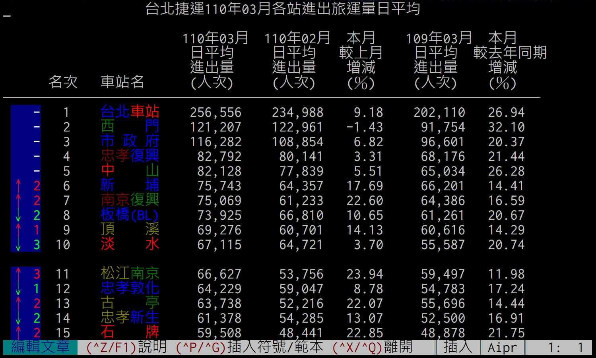

# BBS-MRT-Statistics-Generator
將當月的 **台北捷運各站進出旅運量日平均** 統計結果複製到剪貼簿，以便到 BBS 站文章貼上。  

格式參考 https://www.ptt.cc/bbs/MRT/M.1618474208.A.381.html

# Usage
從 `requirements.txt` 安裝所需套件：
```shell
$ pip install -r requirements.txt
```

使用 python3 (>= 3.8) 執行 `main.py` ：
```shell
$ python3 main.py [-h] year month
```

到 PTT 編輯文章處貼上即可。  
  


# TODO
- [ ] 支援雙色字
- [ ] 標示通車以來最高運量